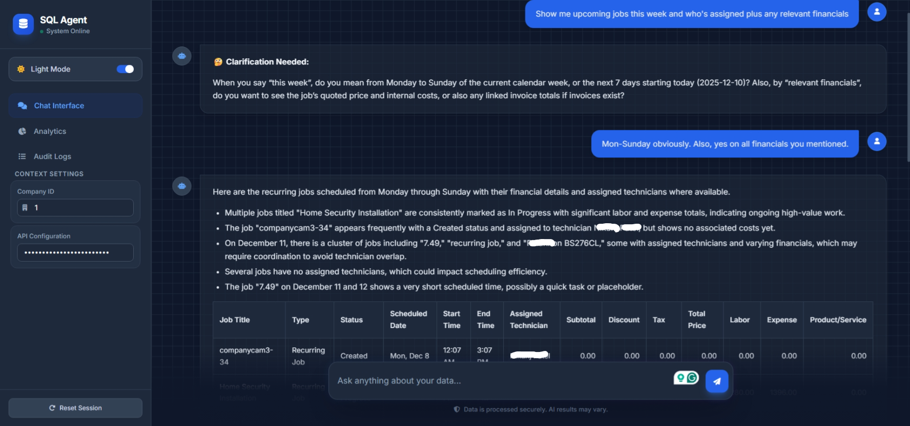
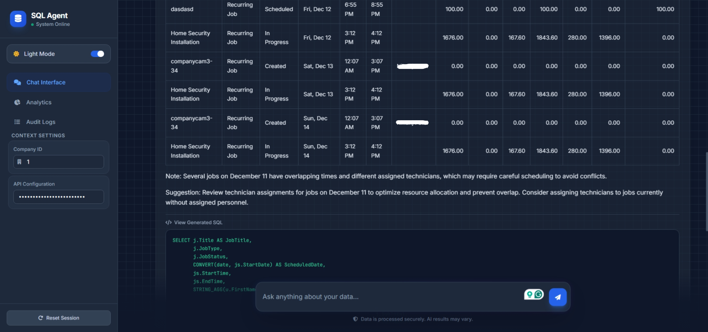
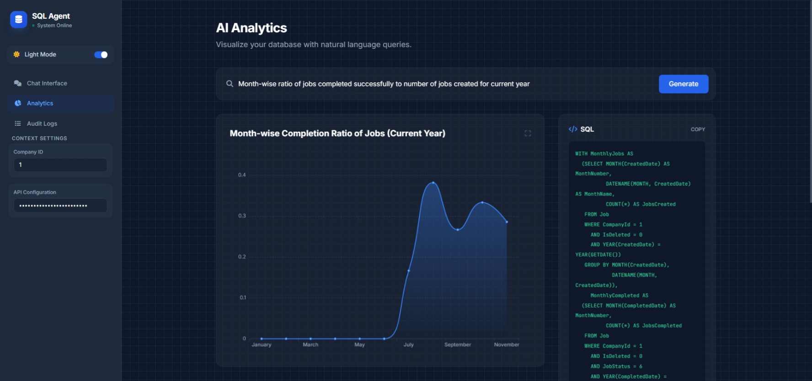
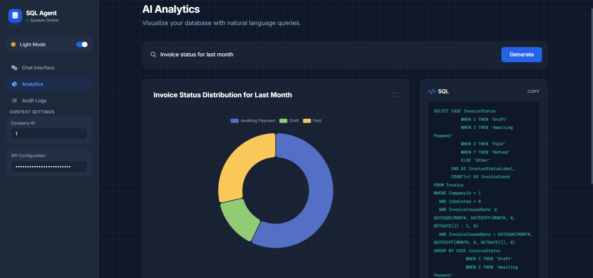
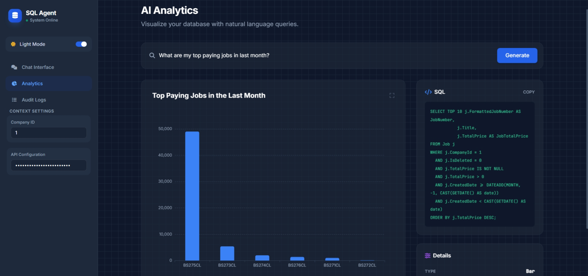
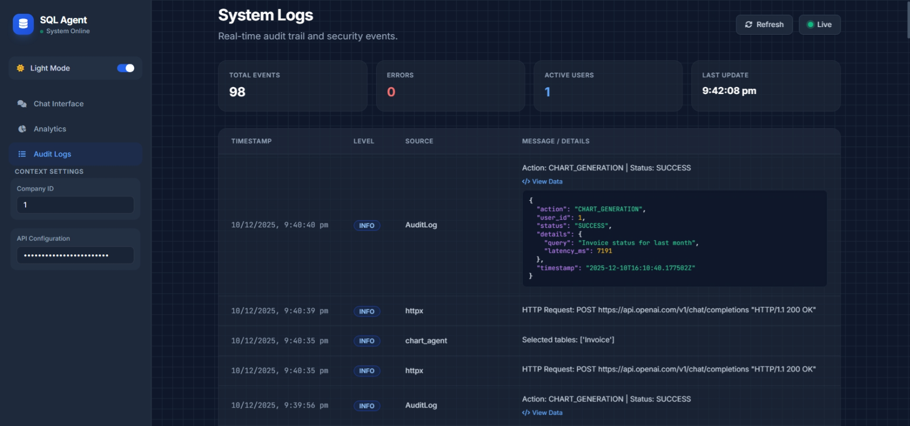
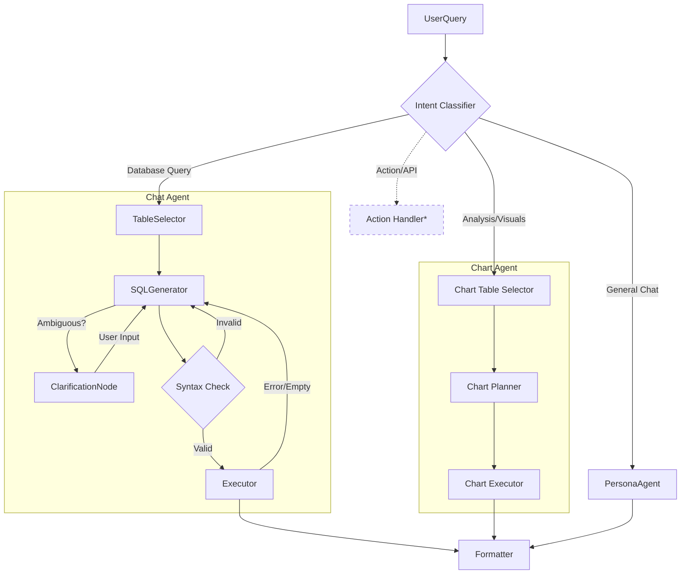
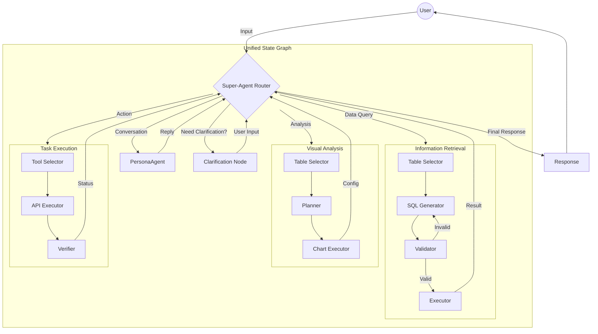

# SenseSaaS

**Making SaaS Accessible for Everyone**


SenseSaaS is a universal AI Agent Interface designed to revolutionize how users interact with SaaS platforms. By serving as an intelligent add-on layer, it completely eliminates the learning curve associated with complex software, allowing users to navigate, query, and operate any application using natural language.

> **Note**: This repository serves as a reference implementation of the Agentic Framework, demonstrated here using a **Retail Analytics** domain. The core architecture is domain-agnostic and can be adapted to any SaaS vertical (CRM, ERP, HRM, Field Service, etc.).

---

## 📑 Table of Contents

1.  [Overview](#overview)
2.  [Motivation & Business Value](#motivation--business-value)
3.  [Use Cases](#use-cases)
4.  [User Stories](#user-stories)
5.  [Core Features](#core-features)
6.  [Security & Safety](#security--safety)
7.  [Screenshots](#screenshots)
8.  [Architecture](#architecture)
9.  [Technology Stack](#technology-stack)
10. [System Requirements](#system-requirements)
11. [Installation & Setup](#installation--setup)
12. [Configuration](#configuration)
13. [Usage Guide](#usage-guide)
14. [Project Structure](#project-structure)
15. [API & Database Overview](#api--database-overview)
16. [Agentic Processing Pipeline](#agentic-processing-pipeline)
17. [Troubleshooting](#troubleshooting)
18. [Future Directions & Roadmap](#future-directions--roadmap)
19. [Contributing](#contributing)
20. [License](#license)

---

## 🚀 Overview

**SenseSaaS** is a **FastAPI & LangGraph-based framework** that bridges the gap between natural language intent and structured system execution. Built on **LangGraph**, it treats the AI not just as a chatbot, but as a stateful agent capable of reasoning, planning, and executing complex workflows.

The system is built around three core pillars:

1.  **🧠 Intelligent Query Resolution** — Uses a multi-agent SQL pipeline with self-correction to translate natural language questions into accurate database queries.
2.  **📊 Dynamic Data Visualization** — Automatically generates chart configurations (Pie, Bar, Line) from natural language analysis requests.
3.  **💬 Conversational Memory** — Maintains multi-turn conversation state, allowing users to refine queries and build upon previous results.

### How it Works
The system acts as an intelligent intermediary:
-   **User**: Speaks in plain English.
-   **SenseSaaS Agent**: Translates intent into SQL, API calls, or Visualization configs.
-   **SaaS Backend**: Executes the strict logic (Database/API).

---

## 💡 Motivation & Business Value

### Problem Statement

Traditional SaaS platforms present significant adoption challenges:

- ❌ **Steep Learning Curves** — Users must memorize menu structures, filter configurations, and report builders before becoming productive.
 ❌ **Data Inaccessibility** — Business insights are locked behind technical interfaces that non-technical staff cannot navigate.
- ❌ **Training Overhead** — Organizations spend thousands on training sessions every time a new hire joins or software updates.
- ❌ **Mobile Limitations** — Complex UIs don't translate well to mobile devices, limiting field worker productivity.
- ❌ **Expertise Bottlenecks** — Only a few "power users" know how to extract valuable reports, creating organizational dependencies.

### The "Zero Learning Curve" Promise

SenseSaaS effectively "flattens" the UI:
-   **No Menu Navigation**: Users trigger features by asking for them.
-   **Instant Expertise**: An entry-level employee can perform expert-level analysis on Day 1.
-   **Universal Accessibility**: From **C-suite executives** to **blue-collar field workers**, anyone can interact with complex data systems without needing technical training or desk access.

### Business Value Proposition

| Benefit | Impact |
|---------|--------|
| **Time-to-Insight** | Reduces information retrieval from 5-10 clicks to 1 question (~90% faster) |
| **Operational Efficiency** | Multi-step wizards replaced by single commands, reducing errors |
| **Decision Speed** | Inline charts eliminate need for external BI tools (Excel, Tableau) |
| **Training Costs** | Near-zero onboarding time for new staff |
| **Mobile Enablement** | Field workers access data without complex mobile UIs |
| **Scalability** | Same interface handles unlimited data complexity |

---

## 🎯 Use Cases

### 1. **Multi-Location Retail Analytics**
A retail chain with 50+ stores uses SenseSaaS to empower store managers. Instead of logging into a complex analytics dashboard, managers simply ask: *"What were my top 5 selling products last week compared to the week before?"* The agent generates the SQL, executes it against the central MS SQL database, and presents a formatted comparison table—all within seconds.

### 2. **Field Service Management**
A plumbing company deploys SenseSaaS for its technicians. While on-site, a technician wearing gloves can ask via voice (future): *"Show me the service history for this customer's address."* The agent retrieves the information without the technician needing to navigate a mobile app.

### 3. **E-commerce Customer Support**
A support agent handling a customer complaint asks: *"Find all orders for customer email john.doe@example.com in the last 90 days and show their statuses."* The agent validates the query, enforces multi-tenancy (filtering to the support agent's company), and returns a clean table.

### 4. **Executive Dashboards**
A CFO preparing for a board meeting asks: *"Show me the monthly revenue trend for the last 12 months as a line chart."* The Chart Agent generates the SQL aggregation and returns an ECharts configuration, rendering an interactive visualization instantly.

### 5. **Inventory Management**
A warehouse manager asks: *"Which products have stock levels below the reorder point?"* The agent queries the `Inventory` table with appropriate filters and returns an actionable list.

---

## 👤 User Stories

### 🛠️ Field Workers / Blue-Collar Staff
-   **As a** delivery driver, **I want to** ask for my delivery schedule verbally **so that** I don't have to handle a tablet while driving.
-   **As a** warehouse worker, **I want to** check inventory levels by asking a question **so that** I can focus on physical tasks.
-   **As a** field technician, **I want to** look up customer service history on-site **so that** I can diagnose issues faster without office support.

### 👔 Managers / Analysts
-   **As a** store manager, **I want to** compare this week's sales to last week **so that** I can identify trends without building a report.
-   **As a** sales manager, **I want to** see a chart of revenue by product category **so that** I can report to leadership with visual evidence.
-   **As an** HR manager, **I want to** ask for headcount by department **so that** I don't need to query the HRIS system manually.

### 🎧 Customer Support / Operations
-   **As a** support agent, **I want to** find a customer's order history instantly **so that** I can resolve their ticket during the first call.
-   **As an** operations lead, **I want to** identify overdue orders **so that** I can escalate them before customers complain.

### 💻 Administrators / IT
-   **As a** system admin, **I want to** configure the schema files **so that** the agent understands our specific database structure.
-   **As an** IT manager, **I want to** review query logs **so that** I can audit agent activity for compliance.

---

## ✨ Core Features

### 1. **Natural Language to SQL (Chat Agent)**
-   Multi-turn conversational queries with memory.
-   Self-correcting SQL generation: If a query fails, the agent automatically revises it.
-   **Clarification Node**: When the user's request is ambiguous, the agent asks clarifying questions instead of guessing.
-   Supports complex JOINs, GROUP BY, aggregations, and date filtering.

### 2. **Dynamic Visualization (Chart Agent)**
-   Accepts natural language analysis requests (e.g., *"Show revenue by month"*).
-   Automatically selects chart type: **Pie** (distribution), **Bar** (comparison), **Line** (trends).
-   Returns ECharts-compatible JSON configuration for frontend rendering.

### 3. **Intent Classification**
-   Routes incoming messages to the appropriate handler:
    -   `data_query` → SQL Agent
    -   `general_query` → Persona Agent (greetings, off-topic)
    -   `malicious_query` → Blocked with security alert

### 4. **Persona Agent (SaasCee)**
-   Handles non-data queries: greetings, capability explanations, off-topic rejections.
-   Professional, helpful tone configured via system prompts.

### 5. **Enum/Lookup Translation**
-   Automatically maps integer status codes to human-readable labels (e.g., `1` → "Pending", `2` → "Completed").
-   Driven by schema descriptions in `description_B.json`.

### 6. **Result Formatting**
-   Converts raw SQL results into business-friendly markdown tables.
-   Redacts audit columns (`CreatedBy`, `ModifiedDate`) and internal IDs.
-   Provides natural language summaries above data tables.

### 7. **Enterprise-Grade Logging & Auditing**
-   **Structured JSON Logs**: All events are saved as structured JSON (`logs/audit_YYYYMMDD.json`) for easy ingestion into tools like Splunk or Datadog.
-   **Color-Coded Console**: Developer-friendly output with distinct colors for Errors, Warnings, and SQL.
-   **Full Traceability**: Logs capture the entire agent "thought process," including intent classification, raw SQL generation, and validation steps.

---

## 🔒 Security & Safety

SenseSaaS implements multiple layers of security to protect against misuse and data leakage:

### Intent-Level Security
| Feature | Description |
|---------|-------------|
| **Malicious Query Detection** | The Intent Classifier identifies prompt injection attempts, "ignore previous instructions" attacks, and requests for sensitive data. These are blocked with a security alert. |
| **Off-Topic Rejection** | Requests for non-business tasks (e.g., "write Python code", "solve math problems") are politely refused. |

### Query-Level Security
| Feature | Description |
|---------|-------------|
| **Sensitive Data Blocklist** | Columns containing `Password`, `PasswordHash`, `Salt`, `CreditCard`, `SSN`, `SocialSecurity`, `APIKey`, or `Token` are **never** returned, even if explicitly requested. |
| **Adversarial Protection** | The SQL generation prompt instructs the LLM to ignore any user instruction that attempts to bypass security rules. |
| **Multi-Tenancy Enforcement** | All queries automatically include `WHERE CompanyId = X` to prevent cross-tenant data access. |
| **Soft-Delete Filtering** | All queries filter `IsDeleted = 0` to respect logical deletions. |
| **SQL Injection Prevention** | User input is sanitized before being passed to the LLM. Parameterized queries are used where possible. |

### API-Level Security
| Feature | Description |
|---------|-------------|
| **API Key Authentication** | All `/api/*` endpoints require a valid `X-API-Key` header. |
| **Environment-Based Secrets** | Sensitive keys (OpenAI, DB credentials) are loaded from `.env` and never hardcoded. |

---

## 📸 Screenshots
### 💬 Chat Interface
*Natural language queries with formatted results*
<p align="center">
  
  <br><br>
  
</p>

### 📊 Data Visualization
*Interactive ECharts visualizations*
<p align="center">
  
  <br><br>
  
  <br><br>
  
</p>

### 📝 Log Viewer
*Real-time agent activity logs*
<p align="center">
  
</p>

---

## 🏗️ Architecture

The system uses a **LangGraph** state machine to orchestrate the agent's thought process. It is not a linear chain, but a cyclic graph that can self-correct.

### Current Implementation


*Note: Nodes with dashed lines (e.g., Action Handler) are part of the future implementation roadmap.*

---

## 💻 Technology Stack

### Backend
-    **Python 3.10+**: Core application language.
-    **FastAPI**: Async API framework with automatic OpenAPI documentation.
-    **LangGraph**: Agent orchestration with cyclic state machines and memory.
-    **LangChain**: LLM abstraction layer for prompts and chains.
-    **SQLAlchemy**: ORM for database interactions.
-    **OpenAI API**: GPT-5.1 / GPT-4.1-mini for SQL generation and reasoning.

### Frontend
-    **HTML5 / Jinja2**: Server-side rendered templates.
-    **Tailwind CSS**: Utility-first styling.
-    **Apache ECharts**: Interactive data visualizations.

### Infrastructure
-    **Microsoft SQL Server**: Production database.
-    **uv**: Extremely fast Python package installer.
-    **Docker**: Containerized deployment (optional).

---

## ⚙️ System Requirements

### Hardware
-   **CPU**: 2+ cores recommended.
-   **RAM**: 4GB minimum; 8GB+ for concurrent users.
-   **Storage**: 1GB for application; database storage scales with data.

### Software
-   **Python**: Version 3.10 or higher.
-   **Node.js**: Version 16+ (for frontend Tailwind build).
-   **Database**: Microsoft SQL Server 2017+ or Azure SQL.
-   **Operating System**: Windows 10/11, Linux (Ubuntu 20.04+), or macOS.

### External Services
-   **OpenAI API Account**: Valid account with API credits.
-   **Internet Connectivity**: Required for OpenAI API calls.

---

## 🛠️ Installation & Setup

### Step 1: Prerequisites

```bash
# Check Python version
python --version  # Should be 3.10+

# Check Node.js (for frontend)
node --version  # Should be 16+
```

### Step 2: Clone the Repository

```bash
git clone <repository-url>
cd SenseSaaS
```

### Step 3: Configure Environment Variables

Create a `.env` file in the `backend/` directory:

```env
# OpenAI API (Required)
OPENAI_API_KEY=sk-xxxxxxxxxxxxxxxxxxxxxxxxxxxxxxxx

# Database Connection (Required)
DB_SERVER=your.database.server
DB_DATABASE=db_sensesaas
DB_UID=your_username
DB_PWD=your_password

# API Security (Recommended)
APP_API_KEY=your_secure_client_key

# LLM Provider Configuration (Required)
LLM_PROVIDER=openai

# Model Configuration
SMART_MODEL_NAME=gpt-5.1
FAST_MODEL_NAME=gpt-4.1-mini
MODEL_TEMPERATURE=0
```

### Step 4: Run the Application

Use the unified startup script:

```bash
# Windows
start.bat
```

This will:
1.  Create/activate Python virtual environment.
2.  Install Python dependencies via `uv`.
3.  Install frontend dependencies via `npm`.
4.  Launch the FastAPI server at `http://localhost:8000`.

### Step 5: Verify Installation

1.  Open browser to `http://localhost:8000`.
2.  Type: "Hello, what can you do?"
3.  Verify the Persona Agent responds with capabilities.

---

## 🔧 Configuration

### Adapting to a New Domain

> **Important**: While the system is *configuration-driven*, adapting to a completely new domain currently requires updating **both** schema files **and** prompt examples in the agent code. Future versions aim to automate this (see [Roadmap](#future-directions--roadmap)).

1.  **`backend/description_A.txt`**: High-level business context.
    -   What domain is this? (e.g., "We are a Field Service Management platform...")
    -   Global rules: Multi-tenancy (`CompanyId`), soft deletes (`IsDeleted`).

2.  **`backend/description_B.json`**: Technical database schema.
    -   Table names, column names, data types.
    -   Enum mappings in column descriptions (e.g., `"Status": "1=Pending, 2=Completed"`).

3.  **Prompt Tuning** (Advanced):
    -   `langgraph_sql_agent_chat.py`: Update example queries in the SQL generation prompt.
    -   `langgraph_sql_agent_charts.py`: Update chart-relevant examples.


---

## 📖 Usage Guide

### Chat Interface

1.  Navigate to `http://localhost:8000`.
2.  Type a natural language question (e.g., *"Show me all orders from last week"*).
3.  Review the formatted markdown table.
4.  Follow up with refinements (e.g., *"Exclude cancelled orders"*).

### Charts Interface

1.  Navigate to `http://localhost:8000/charts`.
2.  Type an analysis request (e.g., *"Revenue by product category as a pie chart"*).
3.  View the interactive ECharts visualization.

### Logs Interface

1.  Navigate to `http://localhost:8000/logs`.
2.  View real-time agent activity: table selection, SQL generation, errors.
3.  Use for debugging and compliance auditing.

---

## 📂 Project Structure

```
SenseSaaS/
├── backend/
│   ├── app.py                          # FastAPI application & routes
│   ├── langgraph_sql_agent_chat.py     # Chat Agent (Query)
│   ├── langgraph_sql_agent_charts.py   # Chart Agent (Analysis)
│   ├── description_A.txt               # High-level business context
│   ├── description_B.json              # Technical database schema
│   ├── logging_config.py               # Logging utilities
│   ├── utils/
│   │   └── llm_config.py               # LLM model configuration
│   ├── logs/                           # Runtime logs (auto-created)
│   └── .env                            # Environment variables
│
├── frontend/
│   ├── templates/
│   │   ├── index.html                  # Chat interface
│   │   ├── charts.html                 # Visualization interface
│   │   └── logs.html                   # Log viewer
│   ├── static/
│   │   ├── css/                        # Tailwind output
│   │   └── js/                         # Frontend scripts
│   ├── package.json                    # Node.js dependencies
│   └── tailwind.config.js              # Tailwind configuration
│
├── start.bat                           # Unified startup script (Windows)
├── README.md                           # This file
├── DEPLOYMENT.md                       # Production deployment guide
├── LICENSE                             # CC BY-NC-SA 4.0
└── banner.png                          # README banner image
```

---

## 🔌 API & Database Overview

### Flask Routes

| Method | Route | Purpose |
|--------|-------|---------|
| GET | `/` | Chat interface (index.html) |
| GET | `/charts` | Visualization interface |
| GET | `/logs` | Log viewer interface |
| POST | `/api/chat` | Process natural language query |
| POST | `/api/charts` | Generate chart from query |
| GET | `/api/logs` | Retrieve latest log entries |

### Database Expectations

The agent expects the connected MS SQL database to follow these conventions:
-   **Multi-Tenancy**: All tables have a `CompanyId` column.
-   **Soft Deletes**: All tables have an `IsDeleted` column (0 = active).
-   **Schema Definition**: All tables and columns are described in `description_B.json`.

---

## 🧠 Agentic Processing Pipeline

### Chat Agent Flow

```
User Message
    ↓
Intent Classification (data_query / general_query / malicious_query)
    ↓
[If data_query]
    ↓
Table Selection (using description_A.txt)
    ↓
SQL Generation (using description_B.json + LLM)
    ↓
[If ambiguous] → Clarification Node → User Input → SQL Generation
    ↓
SQL Validation (syntax check)
    ↓
[If invalid] → Correction Loop (max 3 iterations) → SQL Generation
    ↓
SQL Execution (against MS SQL)
    ↓
[If error/empty] → Correction Loop → SQL Generation
    ↓
Result Formatting (enum substitution, markdown table)
    ↓
Natural Language Summary
    ↓
Response to User
```

---

## ❓ Troubleshooting

| Issue | Probable Cause | Fix |
|-------|----------------|-----|
| **"Authentication Error"** | Missing or invalid `OPENAI_API_KEY` | Check `.env` file in `backend/`. |
| **"Database Connection Failed"** | Wrong DB credentials or network issue | Verify `DB_SERVER`, `DB_UID`, `DB_PWD`. Ensure SQL Server is accessible. |
| **"I can't answer that"** | Ambiguous or off-topic query | Rephrase with more business context. Check if tables exist in schema. |
| **"No results found"** | Strict multi-tenancy or soft-delete filters | Verify `CompanyId` value. Check if records have `IsDeleted = 0`. |
| **"Max iterations reached"** | SQL generation failed after 3 attempts | Check query complexity. Review logs for specific errors. |
| **Charts not rendering** | ECharts script not loaded | Check browser console for JS errors. Verify `/static/js/` serves correctly. |

---

## 🗺️ Future Directions & Roadmap

### Version 2.0 (Must Have)

#### Actions Framework
-   [ ] **API-First Actions**: Allow the agent to trigger functionalities via **well-defined APIs** of the underlying SaaS platform (e.g., `POST /api/orders/refund`).
-   [ ] **Controlled Execution**: Action layer explicitly maps user intent to existing API endpoints, respecting the platform's native validation and business logic.
-   [ ] **Webhook Notifications**: Trigger Slack/Email on specific events.

#### Enhanced Memory
-   [ ] **Vector Memory**: Long-term storage of user preferences and past interactions using embeddings.
-   [ ] **Context Carry-Over**: Remember filters and entities across sessions.

### Version 2.5 (Should Have)

#### Multi-Database Support
-   [ ] **PostgreSQL & MySQL Support**: Expand the SQL generation engine to support additional dialects beyond T-SQL.
-   [ ] **Driver Abstraction**: Pluggable backend architecture to switch between MS SQL, Postgres, MySQL, etc.

#### Autonomous Domain Adaptation
-   [ ] **Dynamic Schema Discovery**: Agent introspects database schema (tables, columns, relationships, sample data) to auto-generate `description_B.json`.
-   [ ] **AI-Assisted Prompt Tuning**: Use few-shot examples from domain experts to auto-refine SQL generation prompts.
-   [ ] **RLHF (Reinforcement Learning from Human Feedback)**: Incorporate user corrections on generated SQL/responses to continuously improve model alignment.

#### Voice Interface
-   [ ] **Speech-to-Text Integration**: Enable "Talk-to-SaaS" for field workers on mobile.
-   [ ] **Text-to-Speech Responses**: Read results aloud for hands-free operation.

### Version 3.0 (Vision)

#### Unified Multi-Turn Graph
Moving from specialized agents to a single "Super-Graph" that handles Query, Analysis, and Actions in one conversation loop:



---

## 🤝 Contributing

We welcome contributions! Please follow these guidelines:

1.  **Fork** the repository.
2.  **Create a Branch**: `git checkout -b feature/NewFeature`.
3.  **Commit**: `git commit -m "Add NewFeature"`.
4.  **Push**: `git push origin feature/NewFeature`.
5.  **Open a Pull Request**.

### Code Standards
-   Follow PEP 8 for Python code.
-   Use descriptive variable and function names.
-   Add docstrings to functions and classes.
-   Ensure all new features have error handling.

---

## 📄 License

This project is licensed under the [CC BY-NC-SA 4.0](https://creativecommons.org/licenses/by-nc-sa/4.0/) license. This means you may share and adapt the work with attribution, for non‑commercial use, and under the same license.

See LICENSE file for details.

